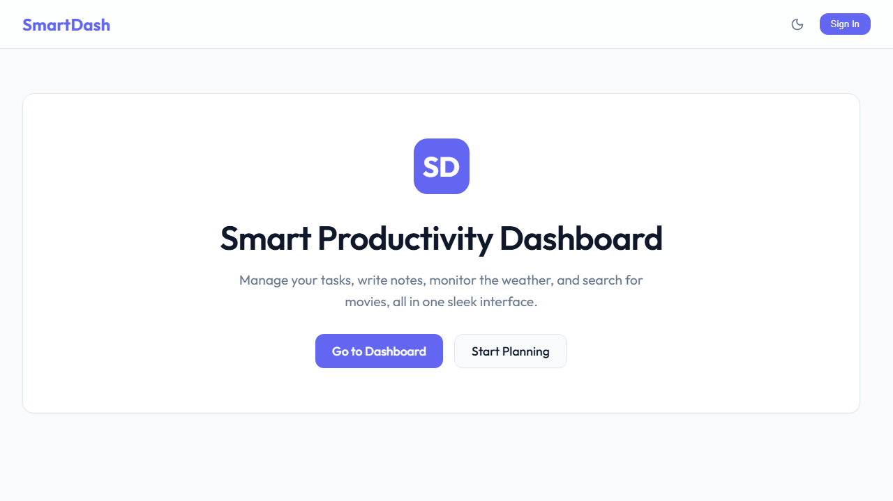

# Smart Productivity Dashboard



A comprehensive and elegantly designed full-stack productivity dashboard that brings your tasks, notes, weather updates, and entertainment into a single unified space.

## Features

- **Dynamic Task Management**: Easily add, edit, track, and filter tasks.
- **Note Taking Application**: Rich text editing with smooth categorization.
- **Weather Widget**: Real-time accurate weather forecasting.
- **Movies & Entertainment**: Stay up to date with trending movies.
- **Beautiful UI System**: A visually stunning interface with custom modern design aesthetic, typography, and responsive menus.
- **User Authentication**: Secure login and signup flows to keep your productivity data safe.

## Tech Stack

- **Frontend**: React (Vite), TypeScript, Context API for state management.
- **Backend & API**: Node.js ecosystem (depending on your setup).
- **Styling**: Vanilla CSS with modern dynamic variables.
- **Routing**: React Router DOM.

## Getting Started

1. **Clone the repository:**
   ```bash
   git clone https://github.com/hridaynath-patil/SmartDash-Project.git
   ```

2. **Navigate to the directory & Install Dependencies:**
   ```bash
   cd SmartDash-Project
   cd client
   npm install
   ```

3. **Start the Development Server:**
   ```bash
   npm run dev
   ```

Happy Organizing!
