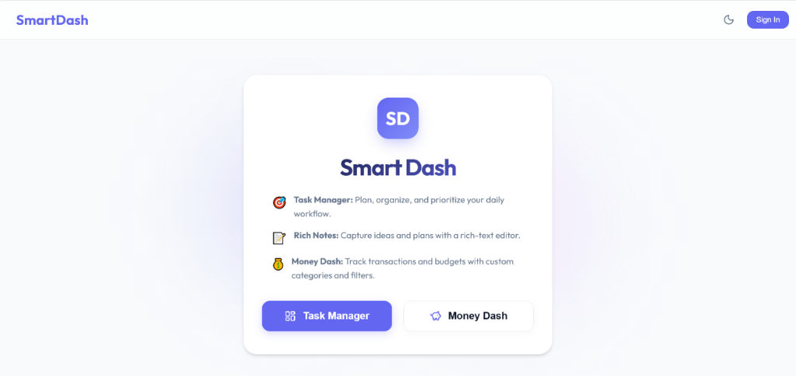
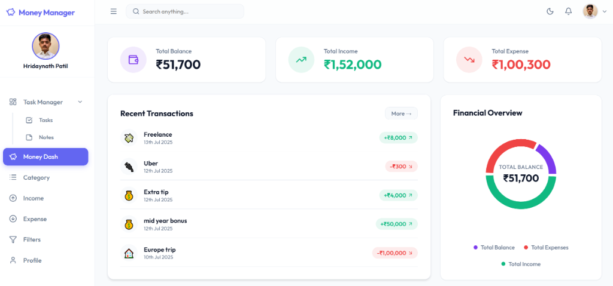
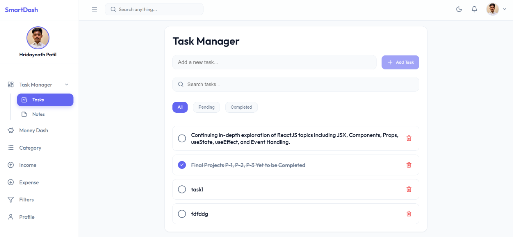
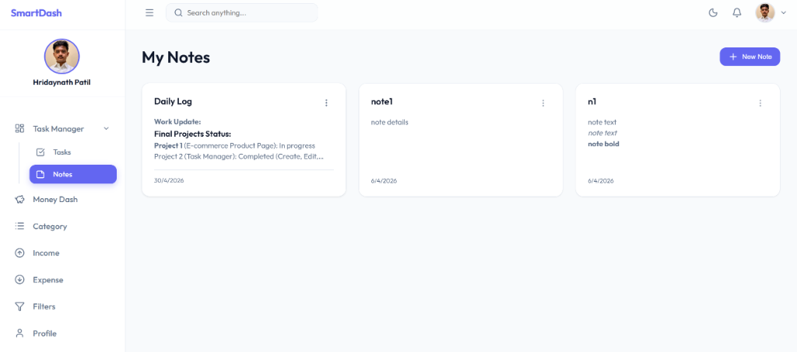
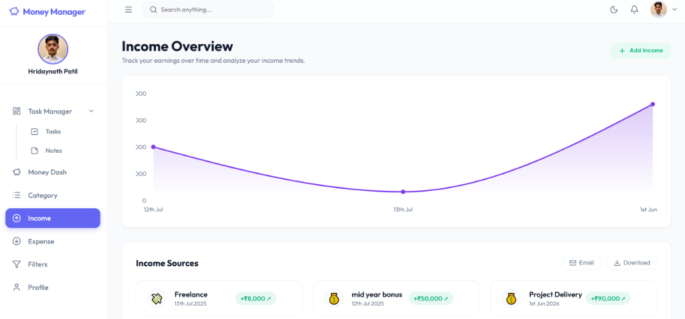

# Smart Productivity Dashboard (Smart Dash)

A comprehensive and elegantly designed full-stack productivity dashboard that brings your tasks, rich notes, and personal financial management into a single unified space.

🔗 **Live Link:** [https://smartdash-project.onrender.com/](https://smartdash-project.onrender.com/)

### 🔑 Demo Credentials
* **Email:** `hridaynathpatil1@gmail.com`
* **Password:** `Zcpl@1234`

### 📸 Application Screenshots
| **Prelogin Landing Page** | **Money Dash (Overview)** |
|:---:|:---:|
|  |  |

| **Tasks Management** | **Rich Notes Editor** |
|:---:|:---:|
|  |  |

| **Income Overview & Trends** |
|:---:|
|  |

---

## Page-by-Page Feature Breakdown

### 1. Prelogin Landing Page
* **Glassmorphic Hero Interface:** A premium landing experience with glowing backdrop gradients, modern typography, and a cozy central card layout.
* **Feature Overview:** A high-level 3-bullet summary introducing visitors to the Task Manager, Rich Notes, and Money Dash ecosystems.
* **Smart Auth Routing:** Features two primary entry buttons (Task Manager & Money Dash) that dynamically navigate users:
  * Automatically forward to target sections if already signed in.
  * Route to the Login screen with target page parameters if unauthenticated, returning them to their chosen page post-login.

### 2. User Authentication (Login & Signup)
* **Secure Login & Registration:** Dedicated, fully-responsive auth screens with robust form input validation (e.g., regex email verification).
* **Interactive Controls:** Password fields equipped with inline eye toggles to easily show/hide input text.
* **State Preservation:** Keeps track of initial navigation intent across login/register switches so users aren't redirected to a default home page after sign up.
* **Return Navigation:** Features a clickable branding header at the top of cards to safely return to the Prelogin landing page.

### 3. Task Manager
* **Tasks Page:**
  * **Creation & Scheduling:** Form controls to schedule tasks with specific titles, descriptions, due dates, custom categories, and priority flags (Low, Medium, High).
  * **Status Filtering:** Tab/toggle filters to inspect task logs by status (All, Pending, Completed).
  * **Inline Management:** Quick task status completion checkboxes, alongside options to edit or delete tasks (with secure confirmation dialogs).
* **Notes Page:**
  * **Rich Text Editing:** Integrated note editor featuring a formatting toolbar for custom styles (Bold, Italic, Underline, Bullet Lists, and Numbered Lists).
  * **Search & Filters:** Real-time search bar to filter notes by title or description content.
  * **Visual Cleanliness:** Clean cards styling showing preview descriptions, category tags, creation dates, and edit/delete actions on hover.

### 4. Money Manager (Money Dash)
* **Dashboard Overview:**
  * **Balance Analytics:** Net financial health tiles showing Total Balance, Income, and Expenses cards.
  * **Visual Analytics:** Interactive custom `AreaChart` plotting net balance trends over time.
  * **Recent Logs:** Consolidated previews of the latest transactions.
* **Category Page:**
  * **Custom Categories:** Ability to register customized categories with names and emojis.
  * **Budget Logs:** View category listings categorized by type.
* **Income Page:**
  * **Income Trends:** Time-series area chart tracking income growth with interactive custom tooltips.
  * **Card List Layout:** Income logs styled in detailed cards with custom badges (`+₹X ↗`), categories, dates, and hover actions.
  * **Add Income Modal:** Interactive popup modal to log new income sources.
  * **Toasts notifications:** Styled success toasts triggered upon transaction creation.
* **Expense Page:**
  * **Expense Trends:** Custom time-series area charts tracking expenses with custom tooltips.
  * **Card List Layout:** Expense logs styled in detailed cards with custom red badges (`-₹X ↘`), category emojis, dates, and hover actions.
  * **Add Expense Modal:** Pop-up modal containing select inputs for categories, amounts, dates, and descriptions.
  * **Toasts notifications:** Red-bordered toast alerts triggered upon successfully adding an expense.
* **Filters Page:**
  * **Single-Row Toolbar:** Unified layout packing Type, Start Date, End Date, Sort Field, Sort Order, and Search input controls into a single row.
  * **Helper Guidance Banner:** Responsive instruction banner displayed until a query is executed.
  * **Instant Filter Results:** Live-matching transaction cards with instant inline edit/delete commands.

### 5. Profile Management
* **Profile Summary:** Unified summary page detailing basic user info and overall productivity metrics.
* **Dynamic Avatar Upload:** File input to upload custom avatar photos, which instantly update the Navbar profile dropdown, the Sidebar profile card, and the profile dashboard.
* **Productivity Stats:** Visual breakdown of completed tasks versus pending actions.
* **Safe Log Out:** Clears local authentication storage and performs a robust redirect back to the Prelogin root page.

### 6. App Navigation (Navbar & Sidebar)
* **Responsive Sidebar:** Fully responsive drawer that collapses on desktop for screen optimization and expands into a mobile menu overlay.
* **Task Manager Dropdown:** Collapsible sidebar submenu that groups Tasks and Notes together.
* **Profile Card & Theme Toggler:** Displays user names and avatars alongside a light/dark theme switch that synchronizes colors instantly across the application.

---

## Tech Stack

* **Frontend:** React (Vite), TypeScript, React Router DOM, Context API (Auth, Finance, Task, Note, Theme, Toast contexts).
* **Backend & API:** Node.js, Express, MongoDB (hosted on Render).
* **Styling:** Vanilla CSS with custom layout tokens and custom keyframe animations.
* **Iconography:** Lucide React icons.

---

## Getting Started

1. **Clone the repository:**
   ```bash
   git clone https://github.com/hridaynath-patil/SmartDash-Project.git
   ```

2. **Navigate to the directory & Install Dependencies:**
   ```bash
   cd SmartDash-Project
   cd client
   npm install
   ```

3. **Start the Development Server:**
   ```bash
   npm run dev
   ```

Happy Organizing!
